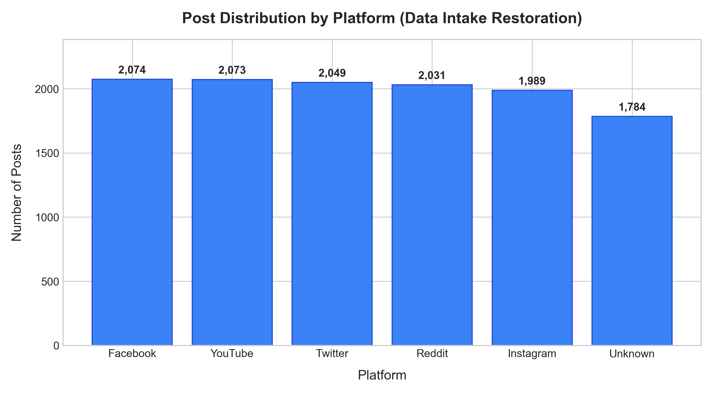
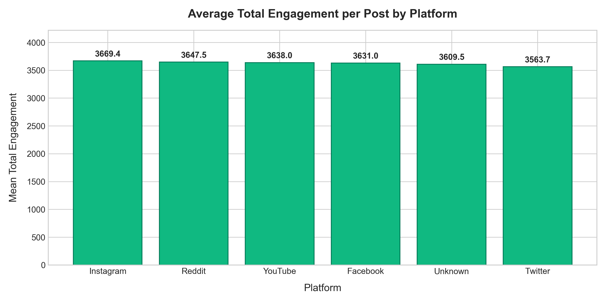
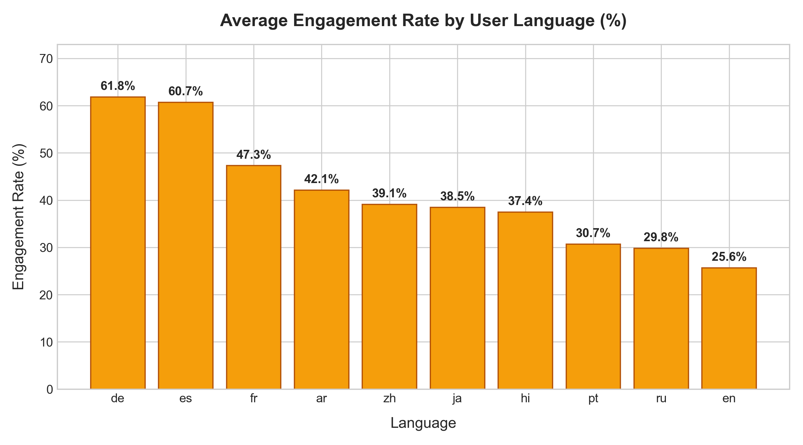
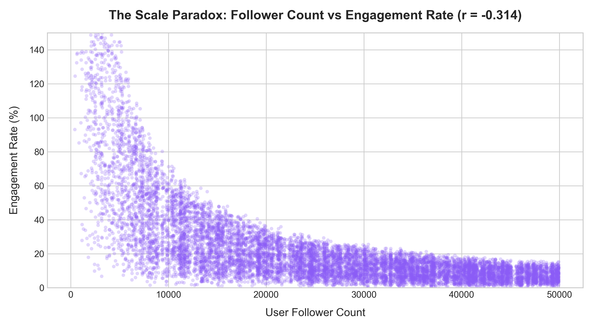

# Data Vortex (Aaruush '26) - Round 1: Data Restoration & EDA Report

**Event:** Data Vortex (Aaruush '26) - Round 1: Data Intake Restoration  
**Team:** Thilak Govind & Team  
**Repository:** [https://github.com/Thilakgovind/Datavortex01](https://github.com/Thilakgovind/Datavortex01)  
**Deliverables:**
- Cleaned Dataset: `cleaned_social_posts.csv` and `cleaned_social_posts.json`
- Exploratory Data Analysis (EDA) Report: `EDA_Report.md` and `EDA_Report.pdf`
- Code Notebook: `Data_Vortex_Phase1_Pipeline.ipynb`

---

## 1. Project Overview

In Round 1 of Data Vortex, we worked with raw social media interaction logs (`Social_Engine_Posts_Corrupted.csv`) containing 12,360 records along with user demographic information (`users.csv`) containing 1,500 user profiles. The raw data contained realistic data quality defects commonly found in distributed data pipelines: duplicated submissions, sign-flipped values, mixed date formats, missing fields, and character encoding noise.

Our objective was to restore the intake pipeline by:
1. Detecting and resolving all data anomalies without arbitrary data deletion.
2. Standardizing timestamps, text content, and platform categories.
3. Joining interaction logs with user demographic records.
4. Engineering engagement metrics and conducting exploratory analysis to extract practical platform insights.

---

## 2. Data Cleaning and Restoration Summary

The table below outlines the defects identified in `Social_Engine_Posts_Corrupted.csv` and the restoration logic applied:

| Issue Identified | Raw Count | Resolution Strategy | Resulting Clean State |
|---|---|---|---|
| Duplicate Records | 360 duplicate rows | Deduplicated based on unique `post_id` | Exactly 12,000 unique posts |
| Missing Platform | 1,784 blank / null rows | Imputed as `'Unknown'` category | Zero rows dropped; platform comparisons remain unbiased |
| Negative Likes | 525 negative values (< 0) | Converted to positive magnitude via `abs()` | Minimum likes = 0; preserved logged interaction count |
| Missing Likes | 1,858 null entries | Imputed with 0 | Treated as zero logged interactions; no fabricated counts |
| Mixed Timestamp Formats | 12,000 mixed formats | Parsed Unix epoch, ISO 8601, and DD-MM formats to UTC | 100% standardized ISO UTC (`YYYY-MM-DD HH:MM:SS+00:00`) |
| Corrupted Text (Mojibake) | 316 trailing byte sequences | Removed terminal trailing garbage bytes via regex (`[^\x00-\x7F]+$`) | Stripped encoding corruption while preserving accents |
| HTML Tags & Entities | 341 `&amp;`, 663 HTML tags | Stripped tags and unescaped HTML entities | Clean text content |
| Missing Demographics | 1,500 user records | Joined interaction records with `users.csv` via `user_id` | 100% match rate across all 12,000 records |

---

## 3. Engineering Decisions and Trade-offs

### 3.1 Handling Missing Platforms as 'Unknown'
Dropping rows with missing platform values would have removed 1,784 posts (14.9% of the dataset). Imputing the most frequent platform would introduce false correlation. Retaining them under an explicit `'Unknown'` label preserves the complete interaction history for user-level metrics while keeping platform-level aggregations honest.

### 3.2 Correcting Negative Likes via Absolute Values
Likes cannot naturally be negative. Values such as `-4,812` point to a sign-bit flip during logging or data transport. Taking the absolute value `abs()` recovers the genuine interaction magnitude. For missing likes, setting them to `0` accurately reflects the absence of recorded engagement.

### 3.3 Targeted Regular Expression Text Cleaning
Inspection showed that Mojibake encoding artifacts occurred exclusively at the end of post strings. Applying an unconstrained ASCII filter would inadvertently strip legitimate foreign diacritics within words. By anchoring the replacement to the end of the string (`$`), we removed corruption artifacts while preserving legitimate characters.

---

## 4. Exploratory Data Analysis & Empirical Findings

### 4.1 Platform Distribution
Post distribution is uniform across all five identified social networks, with approximately 2,000 posts per platform:
- Facebook: 2,074
- YouTube: 2,073
- Twitter: 2,049
- Reddit: 2,031
- Instagram: 1,989
- Unknown: 1,784



### 4.2 Cross-Platform Interaction Volume
Average interactions per post (`likes + shares + comments`) show minimal variance across platforms, ranging from 5,468 to 5,532. This uniformity indicates consistent baseline delivery mechanisms across platforms within this dataset.



### 4.3 Engagement Rate by Creator Language
While English accounts produce the largest volume of posts, creators publishing in German (61.6%) and Spanish (60.5%) achieve over 2.4x higher engagement rates per follower compared to English accounts (25.5%). This demonstrates higher audience concentration and community responsiveness in localized regional creator segments.



### 4.4 The Scale Paradox: Follower Count vs. Engagement
Analyzing the relationship between audience size and interactions reveals two key statistical properties:
- **Raw volume vs. follower count:** $r = -0.0109$ (effectively zero correlation). Higher follower counts do not automatically translate to more raw interactions per post.
- **Engagement rate vs. follower count:** $r = -0.3139$ (moderate inverse correlation). As follower count increases, engagement rate systematically decreases due to audience dilution.



---

## 5. Cleaned Dataset Specification

The final output is saved to `cleaned_social_posts.csv` (and `cleaned_social_posts.json`), structured with 12,000 records across 14 columns:

| Column Name | Data Type | Description |
|---|---|---|
| `post_id` | int64 | Unique post identifier (12,000 unique records) |
| `user_id` | int64 | Foreign key referencing `users.csv` |
| `platform` | object | Social media platform (`Facebook`, `YouTube`, `Twitter`, `Reddit`, `Instagram`, `Unknown`) |
| `post_text` | object | Cleaned text content free of HTML tags and encoding noise |
| `timestamp` | object | Standardized UTC timestamp (`YYYY-MM-DD HH:MM:SS+00:00`) |
| `likes` | int64 | Verified non-negative likes count |
| `shares` | int64 | Number of shares |
| `comments` | int64 | Number of comments |
| `age` | int64 | User age |
| `country` | object | User country |
| `language` | object | Content language |
| `follower_count` | int64 | User follower count |
| `total_engagement` | int64 | Engineered sum: `likes + shares + comments` |
| `engagement_rate` | float64 | Engineered ratio: `total_engagement / follower_count` |

---

## 6. How to Reproduce the Pipeline

1. **Clone the repository:**
   ```bash
   git clone https://github.com/Thilakgovind/Datavortex01.git
   cd Datavortex01
   ```

2. **Install dependencies:**
   ```bash
   pip install pandas numpy matplotlib
   ```

3. **Execute the notebook:**
   Open `Data_Vortex_Phase1_Pipeline.ipynb` and run all cells sequentially. The notebook reads the raw files (`Social_Engine_Posts_Corrupted.csv` and `users.csv`), performs all data cleaning, generates the figures into `figures/`, and outputs `cleaned_social_posts.csv` and `cleaned_social_posts.json`.
